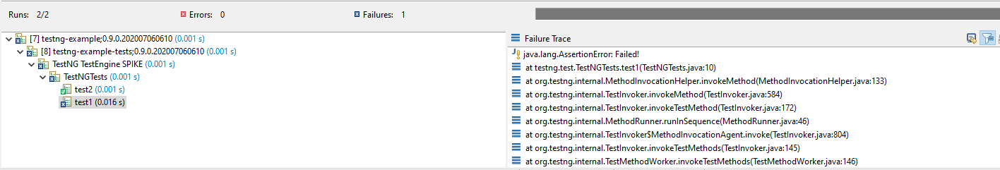

# bnd-testng-example

A small bnd-maven project that demonstrates the use of TestNG with Bnd's JUnit-Platform 
tester in an OSGi environment.

The TestNG/JUnit-Platform team have put together the `testng-junit5` to allow TestNG
to be used inside a JUnit-Platform launch. However, it builds a regular jar, not a bundle, 
so it cannot be used as-is in an OSGi environment. To get around this I have created a
quick fork of this project and added (very rough!) OSGi metadata for it. So you will 
first need to download this project and build/install it locally, and then you can
build/run the example.

## Instructions

1. Clone https://github.com/greekwelfaresa/testng-junit5
2. In the directory where you cloned testng-junit5, run `mvn install` to build and install 
   it into your local Maven repository. It will install as version `0.0.2-SNAPSHOT`
3. Clone https://github.com/greekwelfaresa/bnd-testng-example (the repo where you found 
   this README)

You can now run this example directly on the command line using Maven, or in the GUI 
using Eclipse:

### Using Maven command line

1. Change into the directory where you cloned `bnd-testng-example`.
2. Run "mvn verify" (*Note: you will need mvn in your path.*)
3. You should see output indicating that one test class ran with one success and one 
   failure, something like this:

```
[INFO] --- bnd-testing-maven-plugin:5.1.1:testing (testing) @ testng-example ---
[INFO] Matching glob *
[INFO] Bnd inferred -runee: JavaSE-1.8
TEST testng.test.TestNGTests#test1() <<< ERROR: Failed!
java.lang.AssertionError: Failed!
        at testng.test.TestNGTests.test1(TestNGTests.java:10)
        at sun.reflect.NativeMethodAccessorImpl.invoke0(Native Method)
        at sun.reflect.NativeMethodAccessorImpl.invoke(NativeMethodAccessorImpl.java:62)
        at sun.reflect.DelegatingMethodAccessorImpl.invoke(DelegatingMethodAccessorImpl.java:43)
        at java.lang.reflect.Method.invoke(Method.java:498)
        at org.testng.internal.MethodInvocationHelper.invokeMethod(MethodInvocationHelper.java:133)
        at org.testng.internal.TestInvoker.invokeMethod(TestInvoker.java:584)
        at org.testng.internal.TestInvoker.invokeTestMethod(TestInvoker.java:172)
        at org.testng.internal.MethodRunner.runInSequence(MethodRunner.java:46)
        at org.testng.internal.TestInvoker$MethodInvocationAgent.invoke(TestInvoker.java:804)
        at org.testng.internal.TestInvoker.invokeTestMethods(TestInvoker.java:145)
        at org.testng.internal.TestMethodWorker.invokeTestMethods(TestMethodWorker.java:146)
        at org.testng.internal.TestMethodWorker.run(TestMethodWorker.java:128)
        at java.util.ArrayList.forEach(ArrayList.java:1249)
        at org.testng.TestRunner.privateRun(TestRunner.java:770)
        at org.testng.TestRunner.run(TestRunner.java:591)
        at org.testng.SuiteRunner.runTest(SuiteRunner.java:402)
        at org.testng.SuiteRunner.runSequentially(SuiteRunner.java:396)
        at org.testng.SuiteRunner.privateRun(SuiteRunner.java:355)
        at org.testng.SuiteRunner.run(SuiteRunner.java:304)
        at org.testng.SuiteRunnerWorker.runSuite(SuiteRunnerWorker.java:53)
        at org.testng.SuiteRunnerWorker.run(SuiteRunnerWorker.java:96)
        at org.testng.TestNG.runSuitesSequentially(TestNG.java:1180)
        at org.testng.TestNG.runSuitesLocally(TestNG.java:1102)
        at org.testng.TestNG.runSuites(TestNG.java:1032)
        at org.testng.TestNG.run(TestNG.java:1000)
        at org.testng.junit5.TestNGine.execute(TestNGine.java:81)
        at aQute.tester.bundle.engine.BundleDescriptor.executeChild(BundleDescriptor.java:49)
        at aQute.tester.bundle.engine.BundleEngine.lambda$executeBundle$7(BundleEngine.java:120)
        at java.util.stream.ForEachOps$ForEachOp$OfRef.accept(ForEachOps.java:184)
        at java.util.stream.ReferencePipeline$2$1.accept(ReferencePipeline.java:175)
        at java.util.Iterator.forEachRemaining(Iterator.java:116)
        at java.util.Spliterators$IteratorSpliterator.forEachRemaining(Spliterators.java:1801)
        at java.util.stream.AbstractPipeline.copyInto(AbstractPipeline.java:481)
        at java.util.stream.AbstractPipeline.wrapAndCopyInto(AbstractPipeline.java:471)
        at java.util.stream.ForEachOps$ForEachOp.evaluateSequential(ForEachOps.java:151)
        at java.util.stream.ForEachOps$ForEachOp$OfRef.evaluateSequential(ForEachOps.java:174)
        at java.util.stream.AbstractPipeline.evaluate(AbstractPipeline.java:234)
        at java.util.stream.ReferencePipeline.forEach(ReferencePipeline.java:418)
        at aQute.tester.bundle.engine.BundleEngine.executeBundle(BundleEngine.java:120)
        at aQute.tester.bundle.engine.BundleEngine.lambda$executeBundle$8(BundleEngine.java:133)
        at java.util.stream.ForEachOps$ForEachOp$OfRef.accept(ForEachOps.java:184)
        at java.util.stream.ReferencePipeline$3$1.accept(ReferencePipeline.java:193)
        at java.util.stream.ReferencePipeline$2$1.accept(ReferencePipeline.java:175)
        at java.util.Iterator.forEachRemaining(Iterator.java:116)
        at java.util.Spliterators$IteratorSpliterator.forEachRemaining(Spliterators.java:1801)
        at java.util.stream.AbstractPipeline.copyInto(AbstractPipeline.java:481)
        at java.util.stream.AbstractPipeline.wrapAndCopyInto(AbstractPipeline.java:471)
        at java.util.stream.ForEachOps$ForEachOp.evaluateSequential(ForEachOps.java:151)
        at java.util.stream.ForEachOps$ForEachOp$OfRef.evaluateSequential(ForEachOps.java:174)
        at java.util.stream.AbstractPipeline.evaluate(AbstractPipeline.java:234)
        at java.util.stream.ReferencePipeline.forEach(ReferencePipeline.java:418)
        at aQute.tester.bundle.engine.BundleEngine.executeBundle(BundleEngine.java:133)
        at aQute.tester.bundle.engine.BundleEngine.lambda$execute$5(BundleEngine.java:100)
        at java.util.stream.ForEachOps$ForEachOp$OfRef.accept(ForEachOps.java:184)
        at java.util.stream.ReferencePipeline$3$1.accept(ReferencePipeline.java:193)
        at java.util.stream.ReferencePipeline$2$1.accept(ReferencePipeline.java:175)
        at java.util.Iterator.forEachRemaining(Iterator.java:116)
        at java.util.Spliterators$IteratorSpliterator.forEachRemaining(Spliterators.java:1801)
        at java.util.stream.AbstractPipeline.copyInto(AbstractPipeline.java:481)
        at java.util.stream.AbstractPipeline.wrapAndCopyInto(AbstractPipeline.java:471)
        at java.util.stream.ForEachOps$ForEachOp.evaluateSequential(ForEachOps.java:151)
        at java.util.stream.ForEachOps$ForEachOp$OfRef.evaluateSequential(ForEachOps.java:174)
        at java.util.stream.AbstractPipeline.evaluate(AbstractPipeline.java:234)
        at java.util.stream.ReferencePipeline.forEach(ReferencePipeline.java:418)
        at aQute.tester.bundle.engine.BundleEngine.execute(BundleEngine.java:100)
        at org.junit.platform.launcher.core.DefaultLauncher.execute(DefaultLauncher.java:248)
        at org.junit.platform.launcher.core.DefaultLauncher.lambda$execute$5(DefaultLauncher.java:211)
        at org.junit.platform.launcher.core.DefaultLauncher.withInterceptedStreams(DefaultLauncher.java:226)
        at org.junit.platform.launcher.core.DefaultLauncher.execute(DefaultLauncher.java:199)
        at org.junit.platform.launcher.core.DefaultLauncher.execute(DefaultLauncher.java:132)
        at aQute.tester.junit.platform.Activator.test(Activator.java:352)
        at aQute.tester.junit.platform.Activator.automatic(Activator.java:317)
        at aQute.tester.junit.platform.Activator.run(Activator.java:217)
        at java.util.concurrent.Executors$RunnableAdapter.call(Executors.java:511)
        at aQute.launcher.Launcher.launch(Launcher.java:450)
        at aQute.launcher.Launcher.run(Launcher.java:179)
        at aQute.launcher.Launcher.main(Launcher.java:155)
        at aQute.launcher.pre.EmbeddedLauncher.executeWithRunPath(EmbeddedLauncher.java:170)
        at aQute.launcher.pre.EmbeddedLauncher.findAndExecute(EmbeddedLauncher.java:135)
        at aQute.launcher.pre.EmbeddedLauncher.main(EmbeddedLauncher.java:52)

===============================================
Command line suite
Total tests run: 2, Passes: 1, Failures: 1, Skips: 0
===============================================


Test run finished after 233 ms
[         5 containers found      ]
[         0 containers skipped    ]
[         5 containers started    ]
[         0 containers aborted    ]
[         5 containers successful ]
[         0 containers failed     ]
[         2 tests found           ]
[         0 tests skipped         ]
[         2 tests started         ]
[         0 tests aborted         ]
[         1 tests successful      ]
[         1 tests failed          ]
```

### Using Eclipse

1. Create a fresh Eclipse workspace.
2. Make sure you have a JDK 8 JRE configured in your workspace (TestNG uses `javax.annotations` 
   which needs extra work on some of the higher JDKs to make it work - it can be done but this
   workspace has not configured it).
3. Make sure you have Bndtools and M2E installed.
4. Import the Maven project into your workspace.
5. Find the file `testng-example/test.bndrun`. Right-click on it, select `Run As...|Bnd 
   OSGi Test Launcher (JUnit)`
6. The test should run. In addition to providing similar output on the console as per 
   the Maven example above, you should also see the test results appear in Eclipse's
   JUnit window:

